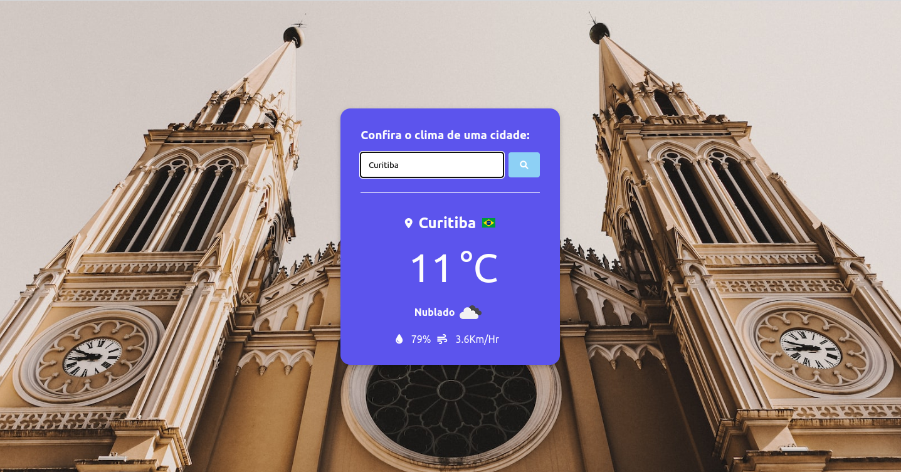

# Monitor climática

Neste projeto foi construido um monitor climático,
utilizando JavaScript/HTML e CSS, este projeto utiliza
3 API'S para seu funcionamento a primeira é a Weather API 
https://openweathermap.org/api, necessário fazer cadastro
no plano Free para conseguir sua Key a segunda é a Country Flag https://countryflagsapi.com
utilizada para mostrar  as Bandeiras de cada Pais onde a cidade
se localiza e por por ultimo a Unsplash https://source.unsplash.com que faz a bucas
das imagens que aparecem no background quando a cidade for pesquisada.
para utilizar o projeto clone-o no seu pc e realize o cadastro na API Weather para obter sua KEY.


## Instalação

Rode o projeto pelo metodo de clone disponivel no github.

```bash
  git clone https://github.com/davi33-emanoel/monitor-de-clima.git
```
Depois de clonado na pasta desejada, abra o vscode e coloque sua key
obtida depois de realizar o cadastro no Weather API, na pasta js e crie um arquivo
```bash
    config.js
```
 conforme demonstrado no arquivo
 ```bash 
  exemploConfig.js
``` 
em seu vscode abra o arquivo index.html para vizualizar o projeto em seu navegador.


    
## Uso

Digite a cidade que deseja vizualizar a temperatura no campo conforme desmonstrado abaixo.

<p textAlign="center">

</p>